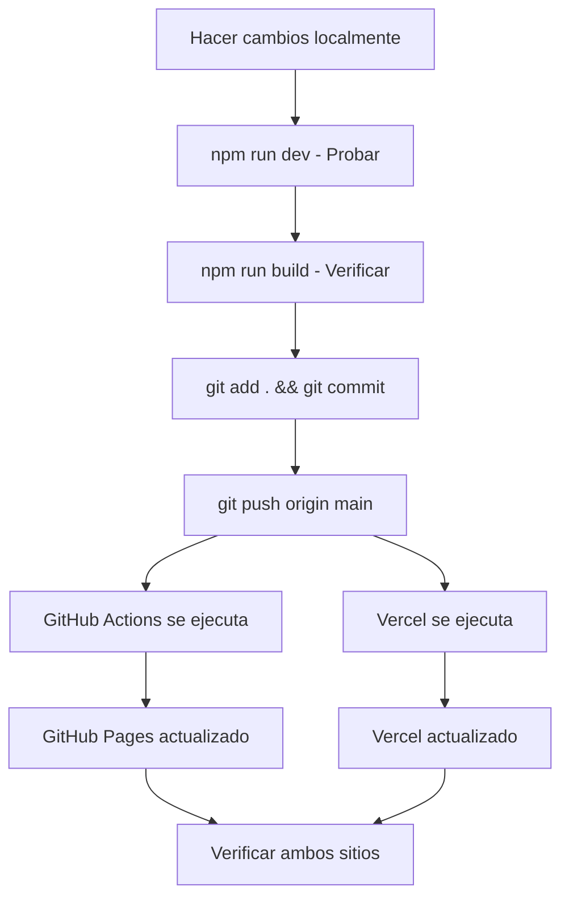

# 🚀 GUÍA MAESTRA DE DEPLOY Y ACTUALIZACIONES - Acrobata Demente

## 📋 Configuración Actual del Proyecto

### Plataformas de Deploy Configuradas:
- ✅ **GitHub Pages** (Principal) - `https://lianacrobata.github.io/AdmApp/`
- ✅ **Vercel** (Alternativa) - URL asignada automáticamente

### Archivos Esenciales del Sistema:
- `DEPLOY-MASTER.md` - **ESTE DOCUMENTO** - Guía completa unificada
- `init-github.ps1` - Script de configuración inicial
- `.github/workflows/deploy.yml` - Deploy automático a GitHub Pages
- `.github/workflows/deploy-vercel.yml` - Deploy automático a Vercel
- `vercel.json` - Configuración específica de Vercel
- `astro.config.mjs` - Configuración principal del proyecto

---

## 🎯 SETUP INICIAL (Solo una vez)

### Opción 1: Script Automático (RECOMENDADO)

```bash
# Windows PowerShell
.\init-github.ps1
```

### Opción 2: Setup Manual

#### 1. Crear Repositorio en GitHub
- Ve a: https://github.com/new
- Nombre: `AdmApp`
- Descripción: `Acrobata Demente - Tienda de productos acrobáticos`
- **Público**
- **NO** marcar "Add a README file"

#### 2. Subir Código Inicial
```bash
git init
git add .
git commit -m "feat: proyecto completo con mejoras de seguridad"
git branch -M main
git remote add origin https://github.com/Lianacrobat/acrobatadm.git
git push -u origin main
```

#### 3. Configurar GitHub Pages
1. Ve a tu repositorio: `https://github.com/Lianacrobat/acrobatadm`
2. `Settings` → `Pages`
3. **Source**: `GitHub Actions`

#### 4. Configurar Secrets (CRÍTICO)

##### GitHub Secrets:
1. `Settings` → `Secrets and variables` → `Actions`
2. Añadir secrets:
   ```
   TELEGRAM_BOT_TOKEN: [tu_nuevo_token]
   TELEGRAM_CHAT_ID: [tu_chat_id]
   ```

##### Vercel Secrets (si usas Vercel):
```
VERCEL_TOKEN: [token_de_vercel]
VERCEL_ORG_ID: [id_organizacion]
VERCEL_PROJECT_ID: [id_proyecto]
TELEGRAM_BOT_TOKEN: [tu_token]
TELEGRAM_CHAT_ID: [tu_chat_id]
```

#### 5. Configurar Vercel (Opcional)

##### Opción A: Desde la Web de Vercel
1. Ve a [vercel.com](https://vercel.com)
2. Inicia sesión con tu cuenta
3. Haz clic en "New Project"
4. Importa tu repositorio de GitHub
5. Vercel detectará automáticamente que es un proyecto Astro
6. Haz clic en "Deploy"

##### Opción B: Usando Vercel CLI
```bash
# Instalar Vercel CLI globalmente
npm i -g vercel

# Login en Vercel
vercel login

# Deploy desde la raíz del proyecto
vercel

# Para deploy de producción
vercel --prod
```

---

## 🔄 ACTUALIZACIONES DIARIAS (Proceso Unificado)

### ⚡ Proceso Simplificado

```bash
# 1. Hacer cambios en tu código
# 2. Probar localmente
npm run dev

# 3. Verificar build
npm run build

# 4. Subir cambios (deploy automático a AMBAS plataformas)
git add .
git commit -m "descripción de los cambios"
git push origin main

# ✅ ¡Listo! GitHub Pages y Vercel se actualizan automáticamente
```

### 🚨 REGLAS IMPORTANTES para Evitar Conflictos

1. **✅ UN SOLO COMANDO**: Solo usa `git push origin main`
2. **❌ NO uses comandos específicos** de plataforma (`vercel deploy`, etc.)
3. **✅ MISMOS SECRETS**: Mantén los mismos valores en ambas plataformas
4. **✅ MISMA RAMA**: Siempre trabaja en `main`
5. **⏳ ESPERA**: Deja que ambos workflows terminen antes del siguiente push

---

## 🔧 COMANDOS DE DESARROLLO

### Desarrollo Local:
```bash
npm run dev          # Servidor de desarrollo (localhost:4321)
npm run build        # Build para producción
npm run preview      # Preview del build
npm run astro        # Comandos CLI de Astro
```

### Scripts de Productos:
```bash
npm run generate-products    # Generar productos
npm run convert-json        # Convertir JSON a TS
npm run validate-products   # Validar productos
npm run sync-products       # Sincronizar dashboard
npm run update-products     # Actualizar productos completo
```

### Scripts de Build:
```bash
npm run build:static        # Build estático
npm run build:github        # Build para GitHub Pages
npm run build:full          # Build completo con CSS
npm run build:styles        # Build de estilos con watch
```

---

## 🚨 SOLUCIÓN DE PROBLEMAS

### Error: "Build Failed"
1. Verifica que `npm run build` funcione localmente
2. Revisa los logs en GitHub Actions (pestaña Actions)
3. Verifica que los secrets estén configurados correctamente
4. Asegúrate de que todas las dependencias estén en `package.json`

### Error: "Secrets Not Found"
1. Ve a `Settings > Secrets and variables > Actions`
2. Verifica que existan: `TELEGRAM_BOT_TOKEN`, `TELEGRAM_CHAT_ID`
3. Para Vercel: también `VERCEL_TOKEN`, `VERCEL_ORG_ID`, `VERCEL_PROJECT_ID`

### Conflictos entre Plataformas:
1. **NO ejecutes** comandos manuales de deploy
2. **SOLO usa** `git push origin main`
3. Espera a que ambos workflows terminen antes del siguiente push
4. Si hay conflictos, revisa los logs de ambas plataformas

### Error de Rutas (Vercel):
1. Verifica que `output: 'static'` esté configurado en `astro.config.mjs`
2. Asegúrate de que todas las rutas sean relativas

---

## 📊 MONITOREO DE DEPLOYS

### GitHub Actions:
- Ve a la pestaña `Actions` en tu repositorio
- Verifica que "Deploy to GitHub Pages" esté en verde
- Revisa logs si hay errores

### Vercel Dashboard:
- Ve a tu proyecto en vercel.com
- Verifica el estado del último deploy
- Revisa logs de build si hay problemas

### URLs de Verificación:
- **GitHub Pages**: `https://lianacrobata.github.io/AdmApp/`
- **Vercel**: URL asignada automáticamente
- **Local**: `http://localhost:4321`

---

## ✅ CHECKLIST DE ACTUALIZACIÓN

- [ ] **Cambios probados localmente** (`npm run dev`)
- [ ] **Build exitoso** (`npm run build`)
- [ ] **Commit descriptivo** (`git commit -m "descripción"`)
- [ ] **Push a main** (`git push origin main`)
- [ ] **Verificar GitHub Actions** (pestaña Actions)
- [ ] **Verificar Vercel** (dashboard de Vercel)
- [ ] **Probar sitios actualizados**

---

## 🔐 SEGURIDAD Y MANTENIMIENTO

### Variables de Entorno Requeridas:
```env
# Telegram Bot (OBLIGATORIO)
TELEGRAM_BOT_TOKEN=tu_nuevo_token_bot
TELEGRAM_CHAT_ID=tu_chat_id

# Configuración de aplicación
NODE_ENV=production
SITE_URL=https://tu-dominio.com

# Seguridad
SECRET_KEY=clave_secreta_para_cifrado_fuerte
API_RATE_LIMIT=100
```

### Regenerar Token de Telegram (CRÍTICO):
1. Ve a @BotFather en Telegram
2. `/revoke` para revocar el token actual
3. `/newtoken` para generar uno nuevo
4. Actualiza el token en ambas plataformas

### Mantenimiento Regular:
```bash
# Verificar vulnerabilidades
npm audit
npm audit fix

# Actualizar dependencias
npm outdated
npm update

# Para actualizaciones mayores
npx npm-check-updates -u
npm install
```

---

## 🎯 FLUJO DE TRABAJO RECOMENDADO



---

## 📚 CARACTERÍSTICAS DEL DEPLOY

### GitHub Pages:
- ✅ **Build automático** con GitHub Actions
- ✅ **HTTPS automático**
- ✅ **CDN de GitHub**
- ✅ **Deploy gratuito**
- ✅ **Integración perfecta con Git**

### Vercel:
- ✅ **Build automático** con cada push
- ✅ **Optimización automática** de assets
- ✅ **CDN Global** de alta velocidad
- ✅ **HTTPS automático** con certificado SSL
- ✅ **Analytics** integrado
- ✅ **Deploy Previews** para cada branch
- ✅ **Edge Functions** disponibles

---

## 🚨 IMPORTANTE ANTES DEL PRIMER DESPLIEGUE

### 🔑 Regenerar Token de Telegram
1. Ve a @BotFather en Telegram
2. `/revoke` para revocar el token actual
3. `/newtoken` para generar uno nuevo
4. Guarda el nuevo token para los secrets

### 🔒 Seguridad Implementada
- ✅ Variables de entorno protegidas
- ✅ Headers de seguridad HTTP
- ✅ Content Security Policy (CSP)
- ✅ Sanitización de entrada
- ✅ Cifrado de datos locales
- ✅ Manejo seguro de errores

---

## 📞 SOPORTE Y RECURSOS

### Si tienes problemas:
1. Revisa este documento completo
2. Verifica los logs en GitHub Actions
3. Revisa el dashboard de Vercel
4. Asegúrate de que los secrets estén configurados correctamente
5. Verifica que el token de Telegram sea válido

### Recursos Adicionales:
- [Documentación de Astro](https://docs.astro.build/)
- [GitHub Actions Docs](https://docs.github.com/en/actions)
- [Vercel Docs](https://vercel.com/docs)
- [OWASP Security](https://owasp.org/www-project-top-ten/)

---

## 🎉 ¡RESUMEN!

**✅ Setup inicial**: Una sola vez con `init-github.ps1` o manual

**✅ Actualizaciones**: Un solo comando `git push origin main`

**✅ Dos plataformas**: GitHub Pages + Vercel automáticamente

**✅ Sin conflictos**: Proceso unificado y documentado

**✅ Seguro**: Variables protegidas y buenas prácticas

---

**🚀 ¡Tu tienda Acrobata Demente está lista para el mundo!**

**Recuerda**: Un solo `git push` actualiza ambas plataformas automáticamente.