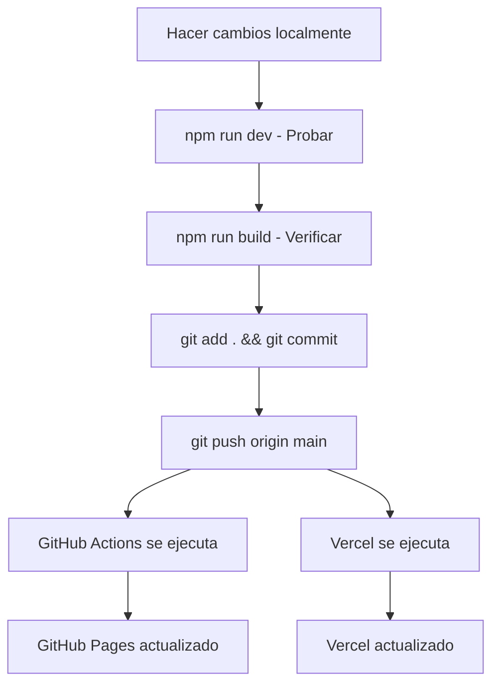

# 🔄 Guía de Actualizaciones - Acrobata Demente

## 📋 Configuración Actual del Proyecto

### Plataformas de Deploy Configuradas:
- ✅ **GitHub Pages** (Principal)
- ✅ **Vercel** (Alternativa)

### Archivos Esenciales:
- `INSTRUCCIONES-DESPLIEGUE.md` - Guía inicial de setup
- `init-github.ps1` - Script de configuración inicial
- `.github/workflows/deploy.yml` - Deploy automático a GitHub Pages
- `.github/workflows/deploy-vercel.yml` - Deploy automático a Vercel

---

## 🚀 Proceso de Actualización Unificado

### 1. **Actualización de Código Local**

```bash
# Hacer cambios en tu código
# Probar localmente con: npm run dev

# Cuando estés listo para actualizar:
git add .
git commit -m "descripción de los cambios"
git push origin main
```

### 2. **Deploy Automático**

**¡IMPORTANTE!** Al hacer `git push`, ambas plataformas se actualizarán automáticamente:

- 🟢 **GitHub Pages**: Se despliega automáticamente via GitHub Actions
- 🔵 **Vercel**: Se despliega automáticamente via su workflow

**URLs de tu sitio:**
- GitHub Pages: `https://lianacrobata.github.io/AdmApp/`
- Vercel: `[URL asignada por Vercel]`

---

## ⚠️ Evitar Conflictos entre Plataformas

### Configuración de Secrets (Una sola vez)

#### GitHub Secrets:
```
TELEGRAM_BOT_TOKEN: [tu_token]
TELEGRAM_CHAT_ID: [tu_chat_id]
```

#### Vercel Secrets (si usas Vercel):
```
VERCEL_TOKEN: [token_de_vercel]
VERCEL_ORG_ID: [id_organizacion]
VERCEL_PROJECT_ID: [id_proyecto]
TELEGRAM_BOT_TOKEN: [tu_token]
TELEGRAM_CHAT_ID: [tu_chat_id]
```

### Reglas para Evitar Conflictos:

1. **✅ UN SOLO COMANDO**: Solo usa `git push origin main`
2. **❌ NO uses comandos específicos** de plataforma (vercel deploy, etc.)
3. **✅ MISMOS SECRETS**: Mantén los mismos valores en ambas plataformas
4. **✅ MISMA RAMA**: Siempre trabaja en `main`

---

## 🔧 Comandos de Desarrollo

### Desarrollo Local:
```bash
npm run dev          # Servidor de desarrollo
npm run build        # Build para producción
npm run preview      # Preview del build
```

### Actualización Completa:
```bash
# 1. Desarrollo y testing
npm run dev

# 2. Verificar build
npm run build

# 3. Subir cambios (deploy automático)
git add .
git commit -m "feat: nueva funcionalidad"
git push origin main

# ✅ ¡Listo! Ambas plataformas se actualizan automáticamente
```

---

## 🚨 Solución de Problemas

### Error: "Build Failed"
1. Verifica que `npm run build` funcione localmente
2. Revisa los logs en GitHub Actions
3. Verifica que los secrets estén configurados

### Error: "Secrets Not Found"
1. Ve a `Settings > Secrets and variables > Actions`
2. Verifica que existan: `TELEGRAM_BOT_TOKEN`, `TELEGRAM_CHAT_ID`
3. Para Vercel: también `VERCEL_TOKEN`, `VERCEL_ORG_ID`, `VERCEL_PROJECT_ID`

### Conflictos entre Plataformas:
1. **NO ejecutes** comandos manuales de deploy
2. **SOLO usa** `git push origin main`
3. Espera a que ambos workflows terminen antes del siguiente push

---

## 📊 Monitoreo de Deploys

### GitHub Actions:
- Ve a la pestaña `Actions` en tu repositorio
- Verifica que "Deploy to GitHub Pages" esté en verde

### Vercel Dashboard:
- Ve a tu proyecto en vercel.com
- Verifica el estado del último deploy

---

## 🎯 Flujo de Trabajo Recomendado



---

## ✅ Checklist de Actualización

- [ ] **Cambios probados localmente** (`npm run dev`)
- [ ] **Build exitoso** (`npm run build`)
- [ ] **Commit descriptivo** (`git commit -m "descripción"`)
- [ ] **Push a main** (`git push origin main`)
- [ ] **Verificar GitHub Actions** (pestaña Actions)
- [ ] **Verificar Vercel** (dashboard de Vercel)
- [ ] **Probar sitios actualizados**

---

## 🔐 Seguridad

- ✅ **Secrets protegidos** en ambas plataformas
- ✅ **HTTPS automático** en ambas plataformas
- ✅ **Variables de entorno** configuradas correctamente
- ✅ **Tokens regenerados** periódicamente

---

**🎉 ¡Con esta guía, tus actualizaciones serán simples y sin conflictos!**

**Recuerda**: Un solo `git push` actualiza ambas plataformas automáticamente.